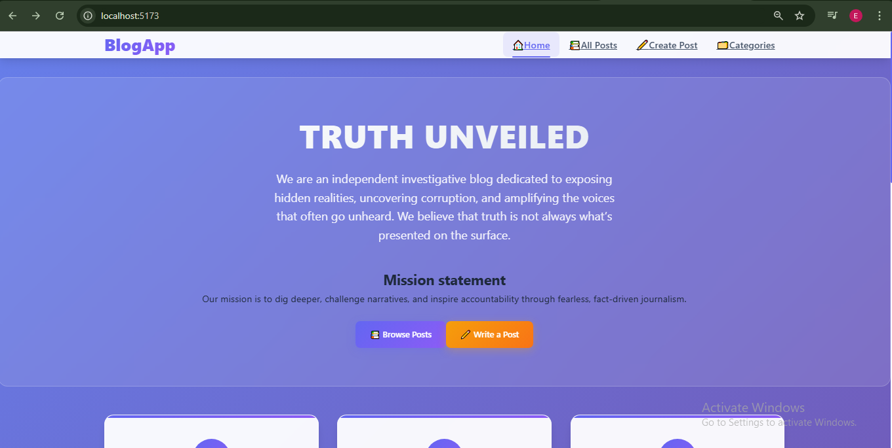
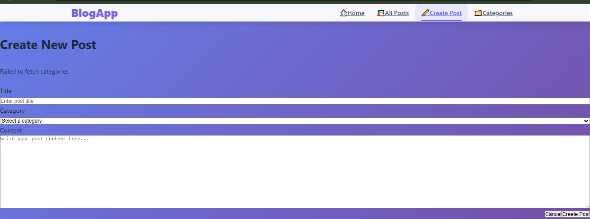
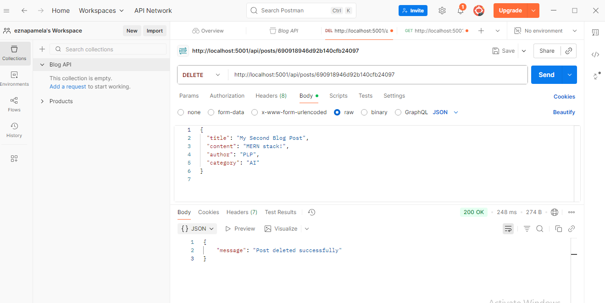
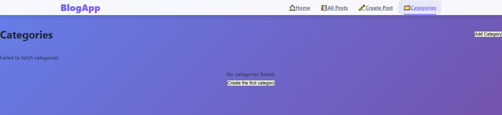

# Truth Unveiled

## Overview 🚀

**Truth Unveiled** is a modern, full-stack blog application built with the **MERN** stack (**MongoDB**, **Express.js**, **React.js**, **Node.js**). This robust platform enables users to create, read, update, and delete blog posts while providing comprehensive category management capabilities.

## Demo Links 🌐

- **Frontend**: [http://localhost:5173](http://localhost:5173)
- **Backend API**: [http://localhost:5001](http://localhost:5001)
- **API Documentation**: [http://localhost:5001/api-docs](http://localhost:5001/api-docs)

## Technology Stack 🛠️

### Frontend
- **React.js** with **Vite** for rapid development
- **React Router DOM** for seamless navigation
- Custom hooks for efficient state management
- **Axios** for reliable API communication
- Modern CSS with glass morphism effects

### Backend
- **Node.js** with **Express.js** framework
- **MongoDB** with **Mongoose ODM** for data management
- **JWT** authentication (ready for implementation)
- **CORS** enabled for cross-origin requests
- **Helmet** for enhanced security
- Environment-based configuration management

## Project Structure 🏗️

```
blogapp/
├── client/                 # React Frontend
│   ├── src/
│   │   ├── components/     # Reusable components
│   │   ├── hooks/         # Custom React hooks
│   │   ├── services/      # API services
│   │   ├── pages/         # Page components
│   │   └── App.jsx        # Main app component
│   └── package.json
└── server/                # Express Backend
    ├── config/            # Database configuration
    ├── models/            # MongoDB models
    ├── routes/            # API routes
    ├── middleware/        # Custom middleware
    └── server.js         # Server entry point
```
## Application Screenshots 📸

Here are some screenshots showcasing the key features of Truth Unveiled:

### Frontend Interface

*Homepage with blog post listings*

### Post Management

*Create new blog post interface*

### API Testing

*Postman API test results*

### Category Management

*Category management interface*

## Getting Started ⚡

### Prerequisites

- **Node.js** (v18 or higher)
- **MongoDB** (local or Atlas)
- **npm** or **yarn**

### Installation & Setup

1. **Clone the repository**
   ```bash
   git clone <your-repository-url>
   cd blogapp
   ```

2. **Backend Setup**
   ```bash
   cd server
   npm install

   # Set up environment variables
   cp .env.example .env
   # Edit .env with your configurations

   # Start the backend server
   npm run dev
   ```

3. **Frontend Setup**
   ```bash
   cd client
   npm install

   # Set up environment variables
   cp .env.example .env
   # Edit .env with your configurations

   # Start the frontend development server
   npm run dev
   ```

### Access Points

- **Frontend**: [http://localhost:5173](http://localhost:5173)
- **Backend API**: [http://localhost:5001](http://localhost:5001)

Environment Variables
Server (.env)

env
NODE_ENV=development
PORT=5000
MONGODB_URI=mongodb://localhost:27017/blogapp
JWT_SECRET=your_jwt_secret_key
CLIENT_URL=http://localhost:5173
Client (.env)

env
VITE_API_BASE_URL=http://localhost:5001/api
VITE_APP_NAME=BlogApp
📚 API Documentation
Base URL
text
http://localhost:5001/api
Posts Endpoints
Get All Posts
URL: GET /posts

Description: Retrieve all blog posts

Response: Array of post objects

Example:

javascript
// Response
{
  "success": true,
  "data": [
    {
      "_id": "123",
      "title": "Sample Post",
      "content": "Post content...",
      "author": "John Doe",
      "category": "Technology",
      "createdAt": "2024-01-01T00:00:00.000Z",
      "updatedAt": "2024-01-01T00:00:00.000Z"
    }
  ]
}
Get Single Post
URL: GET /posts/:id

Description: Retrieve a specific post by ID

Parameters: id - Post ID

Response: Single post object

Create Post
URL: POST /posts

Description: Create a new blog post

Body:

json
{
  "title": "New Post Title",
  "content": "Post content here...",
  "author": "Author Name",
  "category": "Category Name"
}
Validation: All fields are required

Update Post
URL: PUT /posts/:id

Description: Update an existing post

Parameters: id - Post ID

Body: Same as create, all fields optional

Delete Post
URL: DELETE /posts/:id

Description: Delete a post

Parameters: id - Post ID

Response: Success message

Categories Endpoints
Get All Categories
URL: GET /categories

Description: Retrieve all categories

Response: Array of category objects

Create Category
URL: POST /categories

Description: Create a new category

Body:

json
{
  "name": "Category Name",
  "description": "Category description"
}
Health Check
URL: GET /health

Description: Check if server is running

Response: Server status information

🎯 Features Implemented
✅ Core Features
Post Management

Create new blog posts

Read all posts with beautiful card layout

View individual post details

Update existing posts

Delete posts with confirmation

Category System

Create and manage categories

Assign posts to categories

Filter posts by category (ready for implementation)

User Interface

Modern, responsive design

Glass morphism effects

Smooth animations and transitions

Mobile-friendly layout

Professional color scheme

Navigation

React Router for client-side routing

Active link highlighting

Breadcrumb-ready structure

✅ Technical Features
Frontend Architecture

Component-based React architecture

Custom hooks for API calls and state management

Service layer for API communication

Error handling and loading states

Form validation with user feedback

Backend Architecture

RESTful API design

MongoDB with Mongoose ODM

Environment-based configuration

Security middleware (Helmet, CORS)

Error handling middleware

Rate limiting ready

Data Management

MongoDB database with proper schemas

Timestamps for all records

Data validation at model level

Proper error responses

✅ User Experience Features
Responsive Design

Works on desktop, tablet, and mobile

Flexible grid layouts

Adaptive navigation

Interactive Elements

Hover effects on cards and buttons

Smooth page transitions

Loading spinners for async operations

Error messages with helpful feedback

Content Display

Post excerpts with line clamping

Category badges

Date formatting

Clean typography

🚀 Advanced Features Ready for Implementation
🔄 Ready to Add:
User Authentication (JWT setup complete)

Image Uploads (Cloudinary configuration ready)

Search & Filter (Indexes in place)

Pagination (API structure supports it)

Comments System (Database schema extensible)

Likes & Bookmarks (Ready for social features)

🛡️ Security Features
Environment variable protection

CORS configuration

Helmet security headers

Input validation and sanitization

Rate limiting configuration

📱 Pages & Components
Pages
Home (/) - Landing page with features and contact info

All Posts (/posts) - Grid layout of all blog posts

Single Post (/posts/:id) - Detailed post view

Create Post (/posts/create) - Post creation form

Edit Post (/posts/:id/edit) - Post editing form

Categories (/categories) - Category management

Components
Layout - Main app layout with navigation

Navigation - Responsive navigation bar

PostList - Grid display of posts

PostDetail - Individual post view

PostForm - Create/edit post form

CategoryList - Category management

LoadingSpinner - Loading states

ErrorDisplay - Error handling

🎨 Design System
Color Palette
Primary: Indigo/Purple gradients

Background: Glass morphism with blur effects

Text: Gray scale with proper contrast

Accents: Green (success), Red (danger), Orange (warning)

Typography
Font Family: Inter (system font stack)

Weights: 400 (normal), 500 (medium), 600 (semibold), 700 (bold), 800 (extrabold)

Components
Cards: Rounded corners with shadows

Buttons: Gradient backgrounds with hover effects

Forms: Clean inputs with focus states

Navigation: Glass effect with blur

🔧 Development Scripts
Backend (server/)
bash
npm run dev      # Development server with nodemon
npm start        # Production server
npm test         # Run tests
Frontend (client/)
bash
npm run dev      # Development server (Vite)
npm run build    # Production build
npm run preview  # Preview production build
🐛 Troubleshooting
Common Issues
MongoDB Connection Error

Ensure MongoDB is running locally

Check MONGODB_URI in .env file

Verify network connectivity for Atlas

CORS Errors

Verify CLIENT_URL in server .env

Check if frontend is running on correct port

Environment Variables

Ensure both client and server .env files exist

Restart servers after changing .env files

Port Already in Use

Change PORT in .env or kill existing process

Use npx kill-port 5000 or npx kill-port 5173

🤝 Contributing
Fork the repository

Create a feature branch (git checkout -b feature/amazing-feature)

Commit your changes (git commit -m 'Add amazing feature')

Push to the branch (git push origin feature/amazing-feature)

Open a Pull Request

📄 License
This project is licensed under the MIT License - see the LICENSE file for details.

👥 Authors
Ezna Pamela

Truth Unveiled - A modern blogging platform built with passion and the MERN stack! 🚀

